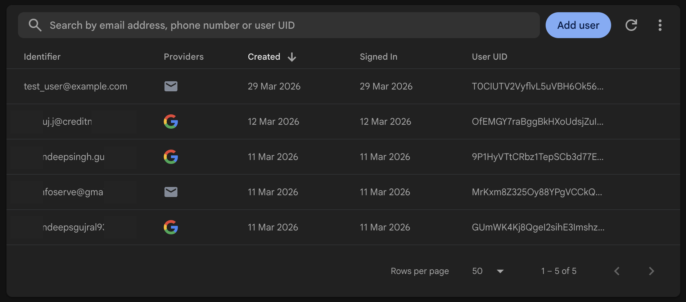

# Selenium_MCP

This server is implemented in python to bridge the gap between the AI Assistant or (custom MCP clients) and Selenium Webdrivers. It exposes selenium webdriver functionalities as MCP tools allowing AI assistanct/MCP clients to user them to perform task for web automation, web testing or web scraping. It provide following set of tools to AI assistant/MCP clients:

1. Web Driver: Create new or quit exiting webdiver sessions
2. Cookies: To manage cookies (add, delete, get, clear)
3. Clicks: To perform clicks on elements (left client, right click, double click)
4. Browser: To navigate urls and manage browser capabilities like resize, maximize, minimize, fullscreen, etc.
5. Scroll: To scroll the entire webpage
6. Input: Input text into elements and select/unselect checkbox, radio buttons, dropdowns options, etc.
7. Find: To find element by xPaths

## Key Features
1. Humanised error handleing, enables LLM to intreperate errors and reconfigure tool usage accordingly
2. Comprehensive element interaction: Clicks, input, select are performed by checking if element is visible, enabled, clickable, etc
3. Full Navigation control: Open New url, click forward, backward, refresh, etc

The tools leverages following technologies to support
1. FastMCP: For MCP server implementation
2. Selenium: For web automation
3. Google GenAI: For AI assistant

## Upcomming
Following are the list of features that will be added in the future:
1. Tools to support Chrome Dev Tools & BiDi
2. Tools to support Java Script Execution
3. Tools to support Upload & Download of Files


## Example

Prompt: "Open https://rfpnotification.com and join the waiting list by entering the email address: [test_user@example.com]"

|Before|After|
|------|-----|
|||

After running the script, the browser took the screenshot to check if the email was entered successfully.


### Test In Action


## Dev Setup
Clone the repository
```
git clone {url}
```

Create virtual environment
```bash
python3 -m venv venv
source venv/bin/activate
```

Install dependencies
```bash
pip install -r requirements.txt
```

Run the server
```bash
python server.py
```

The package comes with a lightweight MCP client using Google GenAI SDK to test the server. It is implemented in `server.py` file. To use it, you need to have a Google GenAI API key. Set it in the `.env` file as `GEMINI_API_KEY={your_api_key}`.

Run the client
```bash
python server.py
```

